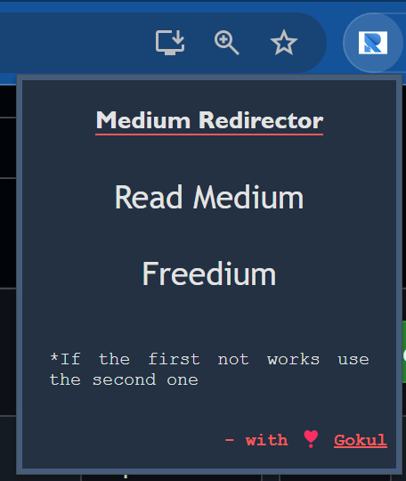

# Medium-Redirector
Chrome Extension Redirects the medium page to @readmedium and @freedium websites

1. Download the zip file and extract in your system.
2. Go to Chrome browser -> Extensions -> Manage Extensions.
3. Click on "Load Unpack" click the extracted folder and load.
4. Go to any medium premium content page then click this extension and click either readmedium or freedium.
5. It opens a new tab on the browser with the read medium or freedium site.

Demo Image

